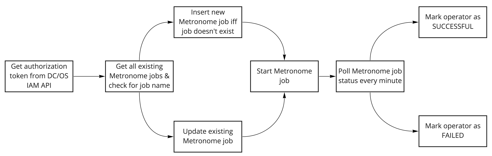

# ny-public-airflow-operators

Open-sourced set of Airflow operators. They can be set up on your Airflow installation by placing them in its plugins directory and restarting the Airflow processes. Tested with Airflow 1.10.2, Python 3.6 and DC/OS 1.13.7.

Featured on our blog post: [Operationalization of Machine Learning Pipelines on Apache Mesos and Hadoop using Airflow](https://www.newyorker.ai/operationalization-of-machine-learning-pipelines-on-apache-mesos-and-hadoop-using-airflow)

# Metronome Operator

For deploying Metronome jobs on your D2iQ DC/OS cluster (formerly known as Mesosphere DC/OS).

The operator takes a [Metronome job definition](https://www.newyorker.ai/anatomy-of-a-metronome-job-definition/) as a JSON parameter and works as depicted in the figure below:



First, it gets an authorization token from the [IAM REST](https://docs.d2iq.com/mesosphere/dcos/1.13/security/ent/iam-api/) API to be able to deploy containers on the DC/OS cluster. Second, it checks whether the job exists via the [Metronome REST API](https://dcos.github.io/metronome/docs/generated/api.html). Depending on the response, it upserts the job definition. Then it starts the job. Finally, it polls for the job status and, depending on the response, changes the Airflow operator’s status to SUCCESSFUL or FAILED.

## Sample Usage in Airflow DAG

```
MetronomeOperator(
        task_id="metronome_operator",
        metronome_job_json=YOUR_METRONOME_JOB_DEFINITION,
        dcos_http_conn_id="dcos_master",
        dcos_robot_user_name=Variable.get("robot_user_name_dcos"),
        dcos_robot_user_pwd=Variable.get("robot_user_pwd_dcos"),
        dag=dag,
        pool="markdown_metronome_job_pool",
        retries=3
    )
```

# HDFS Sensor (Python 3 compatible)

Modification of the [existing Airflow HdfsSensor](https://airflow.apache.org/docs/stable/_modules/airflow/sensors/hdfs_sensor.html) by replacing the HDFSHook with a new one, which uses a Python 3 compatible HDFS client - hdfscli.

Requires the presence of *hdfscli* in Airflow's virtual environment.

## Sample Usage in Airflow DAG

```
NYHDFSSensor(
    task_id="training_data_sensor",
    filepaths=["/data/production/2020-05-13/_SUCCESS"],
    hdfs_conn_id="hdfs_conn_default",
    retries=1440,
    retry_delay=timedelta(minutes=1),
    timeout=0,
    dag=dag)
```
